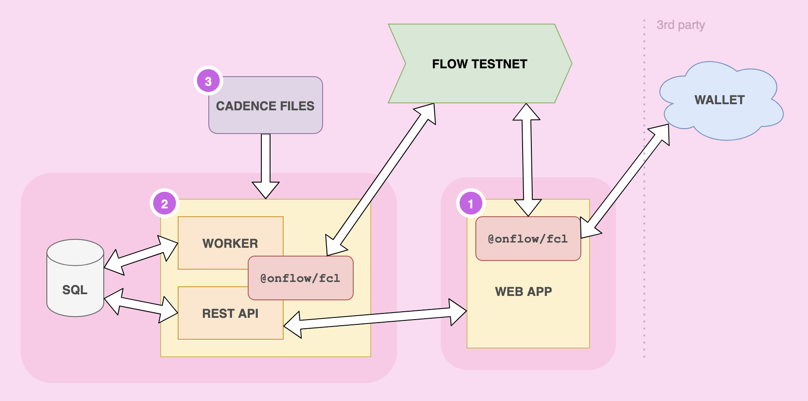

<p align="center">
    <a href="https://kitty-items.onflow.org/">
        
    </a>
</p>

👋 Welcome! This demo app is designed to help you learn to build on Flow.

- Kitty Items: CryptoKitties Sample App is a **complete NFT marketplace** built with [Cadence](https://docs.onflow.org/cadence), Flow's resource-oriented smart contract programming language.
- Learn how to deploy contracts, mint NFTs, and integrate user wallets with the Flow Client Library (FCL).

## 🎬 Live Demo

Check out the [live demo of Kitty Items](https://kitty-items.onflow.org/),
deployed on the Flow Testnet.

## ✨ Getting Started

> Looking for a step by step guide? [**Follow the Kitty Items tutorial in the Flow documentation**](https://docs.onflow.org/kitty-items/install/).

### 1. Install Dependencies

_🛠 This project requires `NodeJS v16.x` or above._ See: [Node installation instructions](https://nodejs.org/en/) <br/>
_🛠 This project requires `flow-cli v0.32.1` or above._ See: [Flow CLI installation instructions](https://docs.onflow.org/flow-cli)

### 2. Clone the project

```sh
git clone --depth=1 https://github.com/onflow/kitty-items.git
```

### 3. Install packages

- Run `npm install` in the root of the project.

⚠️ **NOTE for Mac M1 users:** <br/>
You'll need to run the following command in the web project: <br/>
From the `./web` directory run `npm install -D @next/swc-darwin-arm64`

## Local development

1.  Run `npm run dev:emulator`

    - Local development uses the [Flow Emulator](https://docs.onflow.org/emulator/) and the [FCL Development Wallet](https://github.com/onflow/fcl-dev-wallet) to simulate the blockchain and an FCL-compatible wallet.

2.  In another terminal, from the root of the project run `flow dev-wallet`

Thats it! 🏁

## Testnet development

Run `npm run dev:testnet` and follow the prompt to begin developing on testnet.

---

## Project Overview



## 🔎 Legend

Above is a basic diagram of the parts of this project contained in each folder, and how each part interacts with the others.

### 1. Web App (Static website) | [kitty-items/web](https://github.com/onflow/kitty-items/tree/master/web)

A true dapp, client-only web app. This is a complete web application built with React that demonstrates how to build a static website that can be deployed to an environment like IPFS and connects directly to the Flow blockchain using `@onflow/fcl`. No servers required. `@onflow/fcl` handles authentication and authorization of [Flow accounts](https://docs.onflow.org/concepts/accounts-and-keys/), [signing transactions](https://docs.onflow.org/concepts/transaction-signing/), and querying data using using Cadence scripts.

### 2. Look Ma, a Web Server! | [kitty-items/api](https://github.com/onflow/kitty-items/tree/master/api)

We love decentralization, but servers are still very useful, and this one's no exception. The code in this project demonstrates how to connect to Flow using [Flow JavaScript SDK](https://github.com/onflow/flow-js-sdk) from a Node JS backend. It's also chalk-full of handy patterns you'll probably want to use for more complex and feature-rich blockchain applications, like storing and querying events using a SQL database (Postgres). The API demonstrates how to send transactions to the Flow blockchain, specifically for minting [Kitty Items](https://github.com/onflow/kitty-items/blob/master/cadence/contracts/KittyItems.cdc) (non-fungible tokens).

### 3. Cadence Code | [kitty-items/cadence](https://github.com/onflow/kitty-items/tree/master/cadence)

[Cadence](https://docs.onflow.org/cadence) smart contracts, scripts & transactions for your viewing pleasure. This folder contains all of the blockchain logic for the marketplace application. Here you will find examples of [fungible token](https://github.com/onflow/flow-ft) and [non-fungible token (NFT)](https://github.com/onflow/flow-nft) smart contract implementations, as well as the scripts and transactions that interact with them. It also contains examples of how to _test_ your Cadence code.

## 😺 What are Kitty Items?

Items are hats for your cats, but under the hood they're [non-fungible tokens (NFTs)](https://github.com/onflow/flow-nft) stored on the Flow blockchain.

Items can be purchased from the marketplace with fungible tokens.
In the future you'll be able to add them to [Ethereum CryptoKitties](https://www.cryptokitties.co/) with ownership validated by an oracle.

## ❓ More Questions?

- Chat with the team on the [Flow Discord server](https://discord.gg/xUdZxs82Rz)
- Ask questions on the [Flow community forum](https://forum.onflow.org/t/kitty-items-marketplace-demo-dapp/759/5)

## Troubleshooting

#### Non-Intel issues <br/>

You'll need to run the following command in the web project: <br/>
From the `./web` directory run `npm install -D @next/swc-darwin-arm64` <br/>
If you're running on another non-intel based system, the issue and troubleshooting steps are detailed here: [https://github.com/vercel/next.js/discussions/30468](https://github.com/vercel/next.js/discussions/30468)

#### Rebuild dependencies

- The `api` and `web` projects depend on `sqlite3`. If you change `node` versions on your system, you'll need to cd into the `web` and `api` directory and run `npm rebuild` to rebuild you dependencies for the new version.

#### Finding the logs

- You can see what processes have been started, and if they are online using `pm2 list`
- You can tail logs for individual processes using `pm2 logs [process name]`. eg., `pm2 logs api` or `pm2 logs web`
- You can tail _all logs_ in the same terminal using `pm2 logs`

#### Starting over

- In the event of problems, you may want to start over. To reset the project, perform these steps:
  - Run `pm2 delete all` to stop and delete all processes
  - Delete database files in `./api`. (`kitty-items-db-*.sqlite`)

#### Unblock ports

- Kitty Items uses the following ports. Make sure they are not in use by another process
  - `8080` : Flow emulator
  - `3569` : Flow emulator
  - `3000` : Kitty Items API
  - `3001` : Kitty Items web app
  - `8701` : FCL dev-wallet

#### Understanding the Marketplace

- The Kitty Items Marketplace on testnet is universal. _Every instance of Kitty Items deployed on Testnet points to the same marketplace (`NFTStorefront`) contract_. So, you may see other listing s showing up in your Kitty items instance, but you will not see items in _your_ marketplace page that were added _before_ you deployed your instance of Kitty Items.

---

🚀 Happy Hacking!
